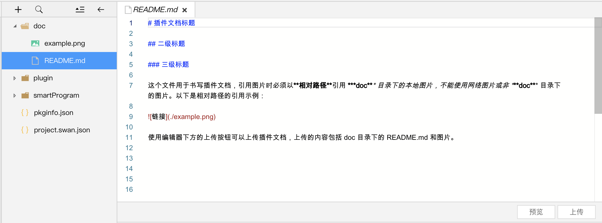

## 插件目录结构 
每个插件中，可以包含自己的自定义组件、页面和 js 接口。

** 插件的目录结构示例： **

```js
plugin
├── api  // 插件自己使用的一些api封装。
│   ├── data.js
├── components  // 插件提供的自定义组件，可以同时提供多个。
│   ├── list.js   
│   ├── list.json
│   ├── list.swan
│   └── list.css
├── pages  // 插件提供的页面，可以同时提供多个。
│   ├── public.js       
│   ├── public.json
│   ├── public.swan
│   └── public.css
├── index.js  // 插件对外暴露的 js 接口
└── plugin.json  // 插件配置文件

```


## 插件配置文件
向第三方小程序开放的所有自定义组件、页面和 js 接口都必须在插件配置文件 plugin.json 列出，格式如下：

```js
{
  "publicComponents": {
    "list": "components/list"
  },
  "pages": {
    "public": "pages/public"
  },
  "main": "index.js"
}
```
这个插件将为第三方小程序提供一个自定义组件`list`，一个页面`public`和接口`index.js`

## 进行插件开发
在插件开发的过程中，有一部分 api 与组件是不可使用或者受限使用的，具体请参考 <a href="/docs/develop/plugins/limit_components/">插件中api的限制</a> 与 <a href="/docs/develop/plugins/limit_components/">插件中组件的限制的限制</a>。

## 自定义组件
** 作用：** 插件可以定义若干个自定义组件，这些自定义组件都可以在插件内相互引用。但提供给第三方小程序使用的自定义组件必须在配置文件中列出（参考上文）。

** 结构：** 除去接口限制以外，自定义组件的编写和组织方式与一般的自定义组件相同，每个自定义组件由 swan模板, css文件, js逻辑 和 json配置 四个文件组成。可以参考<a href="/docs/develop/framework/custom-component/"> 自定义组件 </a>的文档。

## 页面
** 作用：** 插件可以定义若干个插件页面，这些插件页面可以从本插件的自定义组件、其他页面中跳转，或从第三方小程序中跳转。其中，提供给第三方小程序跳转的页面必须在配置文件`plugin.json`中列出（参考上文中的插件配置文件）。

** 结构：** 除去接口限制以外，插件的页面编写和组织方式与一般的页面相同，每个页面由 swan模板, css文件, js逻辑 和 json配置。具体可以参考其他关于页面的文档 <a href="/docs/develop/tutorial/dev_swan/"> 页面开发 </a>。

** 说明：** 插件执行页面跳转的时候，可以使用 navigator 组件或 swan.navigateTo。当插件跳转到自身页面时， url 应设置为这样的形式：plugin-private://providerAppId/$path 。需要跳转到其他插件时，也可以这样设置 url 。

** 代码示例：**
```js
<navigator url="plugin-private://providerAppId/pages/public">
  Go to pages/public!
</navigator>
```

## 接口
** 作用：** 插件可以在接口文件（在配置文件`plugin.json`中指定，详情见上文）中 export 一些 js 接口，供插件的使用者调用。

** 代码示例：**
```js
module.exports = {
  hello: function() {
    console.log('Hello plugin!')
  }
}
```

## 新建插件模板
新建插件开发模板可以在小程序项目引导页中通过选择插件开发模式完成，如下图所示：


新建插件类型的项目后，如果创建示例项目，则项目中将包含三个目录：

 - plugin 目录：插件代码目录。
 - smartProgram 目录：放置一个小程序，用于调试插件。
 - doc 目录：用于放置插件开发文档。

新建项目中创建的`project.swan.json`文件主要包含以下字段：
- `smartProgramRoot`: 用于调试开发插件的小程序路径，默认为`/smartProgram`
- `pluginRoot`: 当前开发插件的路径，默认为`/plugin`
- `developType`: 当前开发模式，用于编译正确对当前项目进行编译，新建插件项目之后默认为`plugin`
- `appid`: 当前项目的`appid`

> 需要注意的点：当`smartProgramRoot`、`pluginRoot`、`developType`任一字段发生变化时，会触发重新编译。

## 插件开发模式
在项目主窗口工具栏的开发模式下拉框中，开发者可以通过选择【插件模式】进行插件开发，如果新建项目的时候选择了【插件】开发模式，进入项目之后会默认选中【插件模式】，开发者无需进行额外操作。


> 需要注意的点：工具栏的开发模式选项，会对以下几个方面有影响：
> 1、工具栏【发布】、【预览】、【远程调试】按钮使用权限的变化，根据当前登录账号和appid的权限情况，切换【开发模式】之后工具栏按钮的可用情况可能会出现变化，例如，账号A有appid1的操作权限，但是appid1没有插件开发权限，所以【开发模式】从【小程序模式】切换到【插件模式】时，【发布】、【预览】、【远程调试】按钮的可用情况会发生变化；
> 2、影响编译对当前项目的编译方式，例如以【插件】开发模式新建一个项目，但是切换到了【小程序模式】，编译时可能会失败并抛出错误；

当【开发模式】下拉选项发生变化时，会触发重新编译。

## 插件发布

插件开发完毕后，可以发布插件。插件发布时，请确保开发模式为 `插件模式`。


点击工具栏发布按钮。填写发布信息后，点击发布面板中的发布按钮即可发布插件。

版本号风格为 Major.Minor.Patch（主版本号.次版本号.修订号）

最低基础库为支持当前插件包运行的最低基础库版本，若用户使用的基础库版本低于设置的最低版本，则无法正常使用插件。


发布插件时会同时上传插件的文档。

### 单独发布插件文档

点击编辑器中 `doc/README.md` 文件，可看到插件文档单独上传的按钮，点击上传即可上传文档，这里会上传 `doc` 目录下的所有文件。



## 其他注意事项
### 插件间互相调用
插件不能直接引用其他插件。但如果小程序引用了多个插件，插件之间是可以互相调用的。

一个插件调用另一个插件的方法，与插件调用自身的方法类似。可以使用 plugin-private://providerAppId 访问插件的自定义组件、页面（不能使用 plugin:// ）。对于 js 接口，可使用 requirePlugin 。
